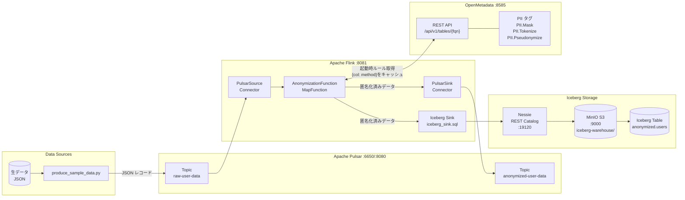

# アーキテクチャ図: メタデータ駆動 仮名化/匿名化パイプライン

## データフロー



## 匿名化ルール (OpenMetadata タグで管理)

| カラム       | PIIタグ               | 匿名化手法       | 例                                      |
|-----------|-----------------------|-------------|----------------------------------------|
| `name`    | `PII.Pseudonymize`    | 仮名化          | `田中太郎` → `Suzuki Ichiro`             |
| `email`   | `PII.Mask`            | マスキング        | `user@gmail.com` → `****@gmail.com`   |
| `phone`   | `PII.Mask`            | マスキング        | `090-1234-5678` → `090-****-5678`     |
| `user_token` | `PII.Tokenize`     | トークン化        | `abc123...` → `tok_a3f9b2c1d4e5f678`  |
| `user_id` | (なし)                | パススルー        | そのまま                                 |
| `age`     | (なし)                | パススルー        | そのまま                                 |
| `region`  | (なし)                | パススルー        | そのまま                                 |

## メタデータ連携の仕組み

```
Flink起動
    │
    ▼
AnonymizationFunction.open()
    │
    ├─ GET /api/v1/tables/name/{TABLE_FQN}?fields=columns
    │       OpenMetadata からカラム定義とタグを取得
    │
    ├─ PII.Mask       → method="mask"
    ├─ PII.Tokenize   → method="tokenize"
    └─ PII.Pseudonymize → method="pseudonymize"
           │
           ▼ ルールをインメモリキャッシュ (TTL 60s)
           │
           ▼ 各レコードの処理
        {field: value} を rule に従い変換して出力
```

## サービス一覧

| サービス              | ポート      | 用途                              |
|--------------------|---------|----------------------------------|
| OpenMetadata UI    | 8585    | PIIタグ・スキーマ管理                  |
| Pulsar Admin UI    | 8080    | トピック・サブスクリプション確認              |
| Flink Web UI       | 8081    | ジョブ監視・チェックポイント確認              |
| MinIO Console      | 9001    | Icebergデータファイル確認               |
| Nessie API         | 19120   | Icebergカタログ REST API            |

## 起動手順

```bash
# 1. 全サービス起動
docker compose up -d

# 2. OpenMetadata にスキーマ・PIIタグ登録 (起動完了まで約3分待機)
python scripts/setup_openmetadata.py

# 3. Flink ジョブ投入
bash scripts/submit_job.sh

# 4. サンプルデータ送信
python scripts/produce_sample_data.py

# 5. 匿名化済みデータ確認
python scripts/verify_output.py
```
